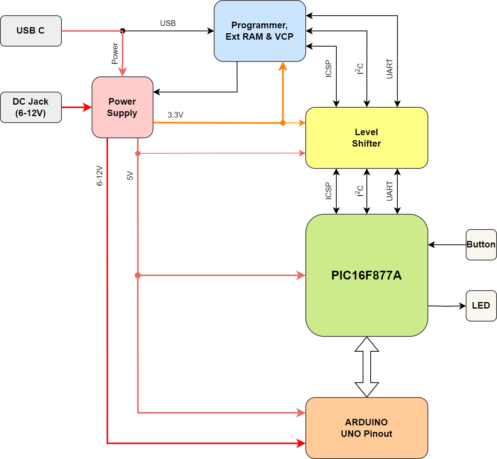

# PIC16F877A MICROCONTROLLER DEVELOPMENT KIT

## 1. Sơ Đồ Khối

## 2. Sơ Đồ Nguyên Lý

## 3. Vi Điều Khiển Chính PIC16F877A

## 4. Môi Trường Lập Trình, Trình Biên Dịch và Công Cụ Hỗ Trợ

### 4.1. Môi Trường Lập Trình MPLAB X IDE

### 4.2. Trình Biên Dịch MPLAB XC8

## 5. Mạch Nạp Tích Hợp

### 5.1. Nạp Chương Trình Mạch Nạp

### 5.2. Cập Nhật Chương Trình Mạch Nạp

### 5.3 Các Trạng Thái LED Lỗi

## 6. Hướng Dẫn Lập Trình Cơ Bản

## 7. Tài Liệu Kỹ Thuật:
* [PIC16F87XA Datasheet](https://ww1.microchip.com/downloads/aemDocuments/documents/MCU08/ProductDocuments/DataSheets/39582C.pdf).
* [PIC16F87XA Programming Specifications](https://ww1.microchip.com/downloads/en/DeviceDoc/39589C.pdf).
